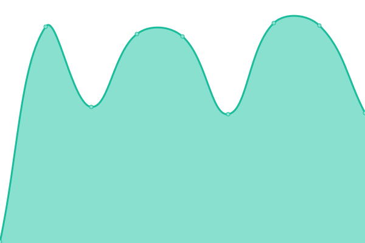

# [📈 Live Status](https://status.teapot.ovh): <!--live status--> **🟧 Partial outage**

This repository contains the open-source uptime monitor and status page for [Luca Tagliavini](teapot.ovh/~luca), powered by [Upptime](https://github.com/upptime/upptime).

With [Upptime](https://upptime.js.org), you can get your own unlimited and free uptime monitor and status page, powered entirely by a GitHub repository. We use [Issues](https://github.com/lucat1/status.teapot.ovh/issues) as incident reports, [Actions](https://github.com/lucat1/status.teapot.ovh/actions) as uptime monitors, and [Pages](https://status.teapot.ovh) for the status page.

<!--start: status pages-->
<!-- This summary is generated by Upptime (https://github.com/upptime/upptime) -->
<!-- Do not edit this manually, your changes will be overwritten -->
<!-- prettier-ignore -->
| URL | Status | History | Response Time | Uptime |
| --- | ------ | ------- | ------------- | ------ |
|  [Host: honey](honey.teapot.ovh) | 🟩 Up | [host-honey.yml](https://github.com/lucat1/status.teapot.ovh/commits/HEAD/history/host-honey.yml) | 

 142ms
     
 | 

<a href="https://status.teapot.ovh/history/host-honey">98.71%</a>
    

|  [Host: kepler](kepler.teapot.ovh) | 🟩 Up | [host-kepler.yml](https://github.com/lucat1/status.teapot.ovh/commits/HEAD/history/host-kepler.yml) | 

 159ms
     
 | 

<a href="https://status.teapot.ovh/history/host-kepler">97.85%</a>
    

|  [Host: fern](fern.teapot.ovh) | 🟩 Up | [host-fern.yml](https://github.com/lucat1/status.teapot.ovh/commits/HEAD/history/host-fern.yml) | 

 148ms
     
 | 

<a href="https://status.teapot.ovh/history/host-fern">100.00%</a>
    

|  [Mail: honey SMTP](mail.teapot.ovh) | 🟥 Down | [mail-honey-smtp.yml](https://github.com/lucat1/status.teapot.ovh/commits/HEAD/history/mail-honey-smtp.yml) | 

 133ms
     
 | 

<a href="https://status.teapot.ovh/history/mail-honey-smtp">91.58%</a>
    

|  [Mail: honey Submission](mail.teapot.ovh) | 🟥 Down | [mail-honey-submission.yml](https://github.com/lucat1/status.teapot.ovh/commits/HEAD/history/mail-honey-submission.yml) | 

 133ms
     
 | 

<a href="https://status.teapot.ovh/history/mail-honey-submission">91.60%</a>
    

|  [Site: teapot.ovh](https://teapot.ovh) | 🟥 Down | [site-teapot-ovh.yml](https://github.com/lucat1/status.teapot.ovh/commits/HEAD/history/site-teapot-ovh.yml) | 

 458ms
     
 | 

<a href="https://status.teapot.ovh/history/site-teapot-ovh">91.61%</a>
    

|  [Site: teapot.ovh (personal site)](https://teapot.ovh/~luca) | 🟥 Down | [site-teapot-ovh-personal-site.yml](https://github.com/lucat1/status.teapot.ovh/commits/HEAD/history/site-teapot-ovh-personal-site.yml) | 

 134ms
     
 | 

<a href="https://status.teapot.ovh/history/site-teapot-ovh-personal-site">91.62%</a>
    

|  [Matrix: server](https://matrix.teapot.ovh) | 🟥 Down | [matrix-server.yml](https://github.com/lucat1/status.teapot.ovh/commits/HEAD/history/matrix-server.yml) | 

 543ms
     
 | 

<a href="https://status.teapot.ovh/history/matrix-server">91.64%</a>
    

|  [Matrix: element](https://element.teapot.ovh) | 🟥 Down | [matrix-element.yml](https://github.com/lucat1/status.teapot.ovh/commits/HEAD/history/matrix-element.yml) | 

 558ms
     
 | 

<a href="https://status.teapot.ovh/history/matrix-element">91.65%</a>
    

|  [Matrix: sliding-sync](https://sliding.teapot.ovh) | 🟥 Down | [matrix-sliding-sync.yml](https://github.com/lucat1/status.teapot.ovh/commits/HEAD/history/matrix-sliding-sync.yml) | 

 484ms
     
 | 

<a href="https://status.teapot.ovh/history/matrix-sliding-sync">0.00%</a>
    

|  [Site: music.teapot.ovh (subsonic)](https://music.teapot.ovh) | 🟥 Down | [site-music-teapot-ovh-subsonic.yml](https://github.com/lucat1/status.teapot.ovh/commits/HEAD/history/site-music-teapot-ovh-subsonic.yml) | 

 629ms
     
 | 

<a href="https://status.teapot.ovh/history/site-music-teapot-ovh-subsonic">91.67%</a>
    

|  [Site: tempo.teapot.ovh (music)](https://tempo.teapot.ovh/tempo/server) | 🟥 Down | [site-tempo-teapot-ovh-music.yml](https://github.com/lucat1/status.teapot.ovh/commits/HEAD/history/site-tempo-teapot-ovh-music.yml) | 

 472ms
     
 | 

<a href="https://status.teapot.ovh/history/site-tempo-teapot-ovh-music">91.68%</a>
    

|  [Site: photos.teapot.ovh](https://photos.teapot.ovh) | 🟩 Up | [site-photos-teapot-ovh.yml](https://github.com/lucat1/status.teapot.ovh/commits/HEAD/history/site-photos-teapot-ovh.yml) | 

 594ms
     
 | 

<a href="https://status.teapot.ovh/history/site-photos-teapot-ovh">97.99%</a>
    

|  [Site: upload.teapot.ovh](https://upload.teapot.ovh) | 🟩 Up | [site-upload-teapot-ovh.yml](https://github.com/lucat1/status.teapot.ovh/commits/HEAD/history/site-upload-teapot-ovh.yml) | 

 687ms
     
 | 

<a href="https://status.teapot.ovh/history/site-upload-teapot-ovh">98.01%</a>
    

|  [Site: dex.teapot.ovh](https://dex.teapot.ovh/auth/ldap/login) | 🟩 Up | [site-dex-teapot-ovh.yml](https://github.com/lucat1/status.teapot.ovh/commits/HEAD/history/site-dex-teapot-ovh.yml) | 

 468ms
     
 | 

<a href="https://status.teapot.ovh/history/site-dex-teapot-ovh">98.02%</a>
    

|  [Site: grafana.teapot.ovh](https://grafana.teapot.ovh) | 🟩 Up | [site-grafana-teapot-ovh.yml](https://github.com/lucat1/status.teapot.ovh/commits/HEAD/history/site-grafana-teapot-ovh.yml) | 

 807ms
     
 | 

<a href="https://status.teapot.ovh/history/site-grafana-teapot-ovh">100.00%</a>
    

|  [Site: loki.teapot.ovh](https://loki.teapot.ovh) | 🟥 Down | [site-loki-teapot-ovh.yml](https://github.com/lucat1/status.teapot.ovh/commits/HEAD/history/site-loki-teapot-ovh.yml) | 

 475ms
     
 | 

<a href="https://status.teapot.ovh/history/site-loki-teapot-ovh">0.00%</a>
    

|  [LDAP: honey STARTTLS](ldap1.teapot.ovh) | 🟥 Down | [ldap-honey-starttls.yml](https://github.com/lucat1/status.teapot.ovh/commits/HEAD/history/ldap-honey-starttls.yml) | 

 140ms
     
 | 

<a href="https://status.teapot.ovh/history/ldap-honey-starttls">91.71%</a>
    

|  [LDAP: honey TLS](ldap1.teapot.ovh) | 🟥 Down | [ldap-honey-tls.yml](https://github.com/lucat1/status.teapot.ovh/commits/HEAD/history/ldap-honey-tls.yml) | 

 140ms
     
 | 

<a href="https://status.teapot.ovh/history/ldap-honey-tls">91.73%</a>
    

|  [LDAP: kepler STARTTLS](ldap2.teapot.ovh) | 🟩 Up | [ldap-kepler-starttls.yml](https://github.com/lucat1/status.teapot.ovh/commits/HEAD/history/ldap-kepler-starttls.yml) | 

 144ms
     
 | 

<a href="https://status.teapot.ovh/history/ldap-kepler-starttls">98.13%</a>
    

|  [LDAP: kepler TLS](ldap2.teapot.ovh) | 🟩 Up | [ldap-kepler-tls.yml](https://github.com/lucat1/status.teapot.ovh/commits/HEAD/history/ldap-kepler-tls.yml) | 

 161ms
     
 | 

<a href="https://status.teapot.ovh/history/ldap-kepler-tls">98.20%</a>
    

|  [DNS: ns-rn-01](ns-rn-01.teapot.ovh) | 🟥 Down | [dns-ns-rn-01.yml](https://github.com/lucat1/status.teapot.ovh/commits/HEAD/history/dns-ns-rn-01.yml) | 

 0ms
     
 | 

<a href="https://status.teapot.ovh/history/dns-ns-rn-01">1.38%</a>
    

|  [DNS: ns-rn-02](ns-rn-02.teapot.ovh) | 🟥 Down | [dns-ns-rn-02.yml](https://github.com/lucat1/status.teapot.ovh/commits/HEAD/history/dns-ns-rn-02.yml) | 

 0ms
     
 | 

<a href="https://status.teapot.ovh/history/dns-ns-rn-02">1.40%</a>
    

|  [DNS: ns-bo-01](ns-bo-01.teapot.ovh) | 🟩 Up | [dns-ns-bo-01.yml](https://github.com/lucat1/status.teapot.ovh/commits/HEAD/history/dns-ns-bo-01.yml) | 

 111ms
     
 | 

<a href="https://status.teapot.ovh/history/dns-ns-bo-01">100.00%</a>
    

<!--end: status pages-->

[**Visit our status website →**](https://status.teapot.ovh)

## 📄 License

- Powered by: [Upptime](https://github.com/upptime/upptime)
- Code: [MIT](./LICENSE) © [Anand Chowdhary](https://anandchowdhary.com), supported by [Pabio](https://pabio.com)
- Data in the `./history` directory: [Open Database License](https://opendatacommons.org/licenses/odbl/1-0/)
