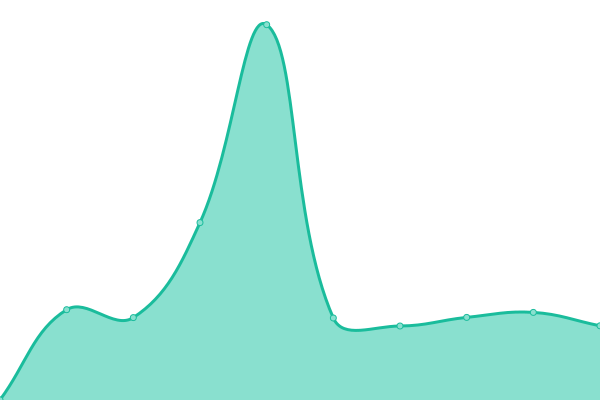

# [📈 Live Status](https://status.teapot.ovh): <!--live status--> **🟧 Partial outage**

This repository contains the open-source uptime monitor and status page for [Luca Tagliavini](teapot.ovh/~luca), powered by [Upptime](https://github.com/upptime/upptime).

With [Upptime](https://upptime.js.org), you can get your own unlimited and free uptime monitor and status page, powered entirely by a GitHub repository. We use [Issues](https://github.com/lucat1/status.teapot.ovh/issues) as incident reports, [Actions](https://github.com/lucat1/status.teapot.ovh/actions) as uptime monitors, and [Pages](https://status.teapot.ovh) for the status page.

<!--start: status pages-->
<!-- This summary is generated by Upptime (https://github.com/upptime/upptime) -->
<!-- Do not edit this manually, your changes will be overwritten -->
<!-- prettier-ignore -->
| URL | Status | History | Response Time | Uptime |
| --- | ------ | ------- | ------------- | ------ |
|  [Host: honey](honey.teapot.ovh) | 🟩 Up | [host-honey.yml](https://github.com/lucat1/status.teapot.ovh/commits/HEAD/history/host-honey.yml) | 

 118ms
     
 | 

<a href="https://status.teapot.ovh/history/host-honey">100.00%</a>
    

|  [Host: picione](picione.teapot.ovh) | 🟩 Up | [host-picione.yml](https://github.com/lucat1/status.teapot.ovh/commits/HEAD/history/host-picione.yml) | 

 119ms
     
 | 

<a href="https://status.teapot.ovh/history/host-picione">100.00%</a>
    

|  [Host: kepler](kepler.teapot.ovh) | 🟩 Up | [host-kepler.yml](https://github.com/lucat1/status.teapot.ovh/commits/HEAD/history/host-kepler.yml) | 

 123ms
     
 | 

<a href="https://status.teapot.ovh/history/host-kepler">100.00%</a>
    

|  [Mail: honey SMTP](mail.teapot.ovh) | 🟩 Up | [mail-honey-smtp.yml](https://github.com/lucat1/status.teapot.ovh/commits/HEAD/history/mail-honey-smtp.yml) | 

 118ms
     
 | 

<a href="https://status.teapot.ovh/history/mail-honey-smtp">100.00%</a>
    

|  [Mail: honey Submission](mail.teapot.ovh) | 🟩 Up | [mail-honey-submission.yml](https://github.com/lucat1/status.teapot.ovh/commits/HEAD/history/mail-honey-submission.yml) | 

 118ms
     
 | 

<a href="https://status.teapot.ovh/history/mail-honey-submission">100.00%</a>
    

|  [Site: teapot.ovh](https://teapot.ovh) | 🟩 Up | [site-teapot-ovh.yml](https://github.com/lucat1/status.teapot.ovh/commits/HEAD/history/site-teapot-ovh.yml) | 

 562ms
     
 | 

<a href="https://status.teapot.ovh/history/site-teapot-ovh">100.00%</a>
    

|  [Site: teapot.ovh (personal site)](https://teapot.ovh/~luca) | 🟩 Up | [site-teapot-ovh-personal-site.yml](https://github.com/lucat1/status.teapot.ovh/commits/HEAD/history/site-teapot-ovh-personal-site.yml) | 

 118ms
     
 | 

<a href="https://status.teapot.ovh/history/site-teapot-ovh-personal-site">100.00%</a>
    

|  [Matrix: server](https://matrix.teapot.ovh) | 🟩 Up | [matrix-server.yml](https://github.com/lucat1/status.teapot.ovh/commits/HEAD/history/matrix-server.yml) | 

 575ms
     
 | 

<a href="https://status.teapot.ovh/history/matrix-server">100.00%</a>
    

|  [Matrix: sliding-sync](https://sliding.teapot.ovh) | 🟥 Down | [matrix-sliding-sync.yml](https://github.com/lucat1/status.teapot.ovh/commits/HEAD/history/matrix-sliding-sync.yml) | 

 0ms
     
 | 

<a href="https://status.teapot.ovh/history/matrix-sliding-sync">100.00%</a>
    

|  [Site: music.teapot.ovh (subsonic)](https://music.teapot.ovh) | 🟩 Up | [site-music-teapot-ovh-subsonic.yml](https://github.com/lucat1/status.teapot.ovh/commits/HEAD/history/site-music-teapot-ovh-subsonic.yml) | 

 1050ms
     
 | 

<a href="https://status.teapot.ovh/history/site-music-teapot-ovh-subsonic">100.00%</a>
    

|  [Site: photos.teapot.ovh](https://photos.teapot.ovh) | 🟩 Up | [site-photos-teapot-ovh.yml](https://github.com/lucat1/status.teapot.ovh/commits/HEAD/history/site-photos-teapot-ovh.yml) | 

 924ms
     
 | 

<a href="https://status.teapot.ovh/history/site-photos-teapot-ovh">100.00%</a>
    

|  [Site: upload.teapot.ovh](https://upload.teapot.ovh) | 🟥 Down | [site-upload-teapot-ovh.yml](https://github.com/lucat1/status.teapot.ovh/commits/HEAD/history/site-upload-teapot-ovh.yml) | 

 3879ms
     
 | 

<a href="https://status.teapot.ovh/history/site-upload-teapot-ovh">0.00%</a>
    

|  [Site: pdf.teapot.ovh](https://pdf.teapot.ovh) | 🟩 Up | [site-pdf-teapot-ovh.yml](https://github.com/lucat1/status.teapot.ovh/commits/HEAD/history/site-pdf-teapot-ovh.yml) | 

 792ms
     
 | 

<a href="https://status.teapot.ovh/history/site-pdf-teapot-ovh">100.00%</a>
    

|  [Site: oauth.teapot.ovh](https://oauth.teapot.ovh/auth/ldap/login) | 🟩 Up | [site-oauth-teapot-ovh.yml](https://github.com/lucat1/status.teapot.ovh/commits/HEAD/history/site-oauth-teapot-ovh.yml) | 

 632ms
     
 | 

<a href="https://status.teapot.ovh/history/site-oauth-teapot-ovh">100.00%</a>
    

|  [Calendar](https://calendar.teapot.ovh) | 🟩 Up | [calendar.yml](https://github.com/lucat1/status.teapot.ovh/commits/HEAD/history/calendar.yml) | 

 1005ms
     
 | 

<a href="https://status.teapot.ovh/history/calendar">100.00%</a>
    

|  [Vaultwarden](https://vault.teapot.ovh) | 🟩 Up | [vaultwarden.yml](https://github.com/lucat1/status.teapot.ovh/commits/HEAD/history/vaultwarden.yml) | 

 752ms
     
 | 

<a href="https://status.teapot.ovh/history/vaultwarden">100.00%</a>
    

<!--end: status pages-->

[**Visit our status website →**](https://status.teapot.ovh)

## 📄 License

- Powered by: [Upptime](https://github.com/upptime/upptime)
- Code: [MIT](./LICENSE) © [Anand Chowdhary](https://anandchowdhary.com), supported by [Pabio](https://pabio.com)
- Data in the `./history` directory: [Open Database License](https://opendatacommons.org/licenses/odbl/1-0/)
